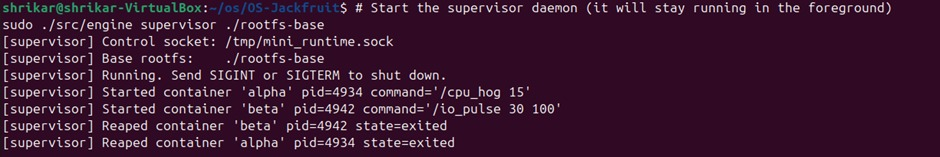
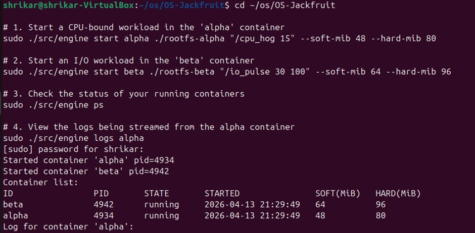
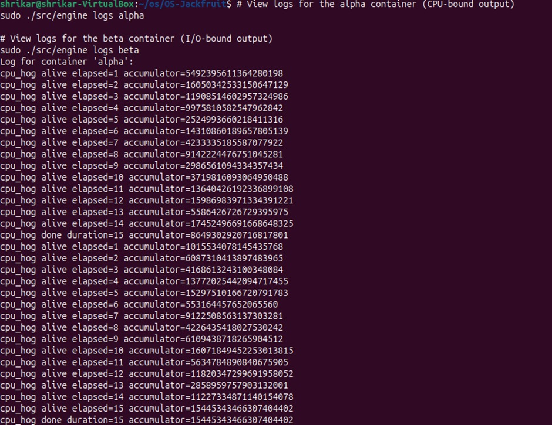
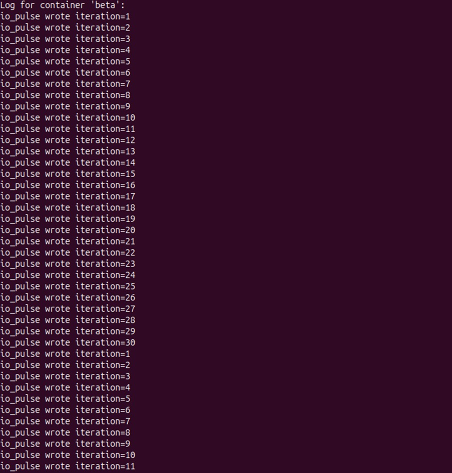
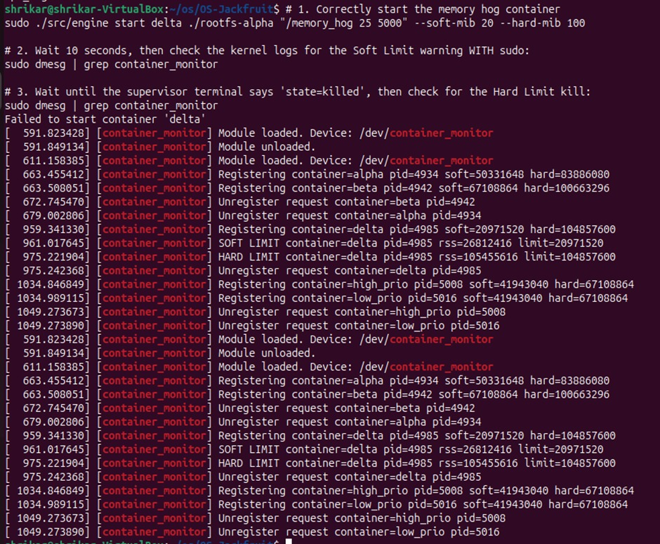
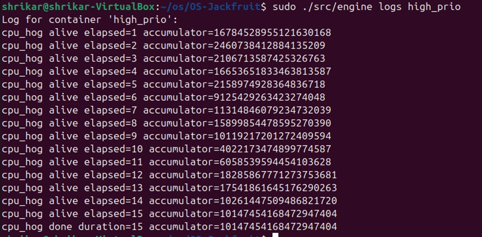
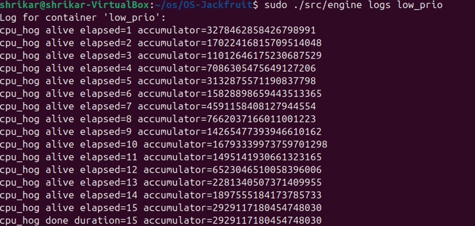
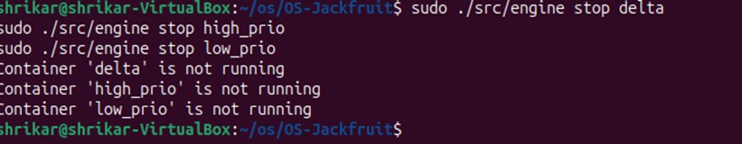
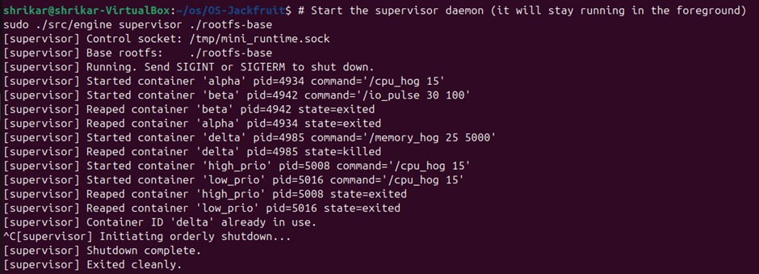
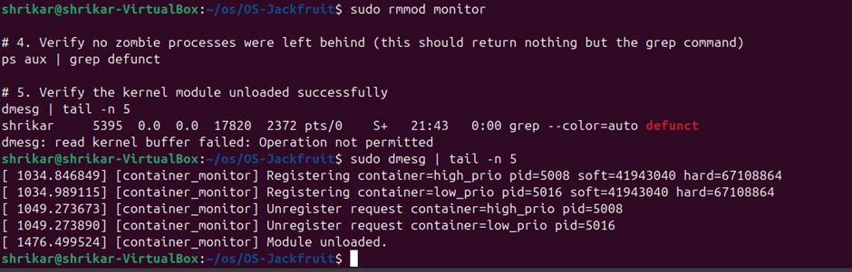

# Multi-Container Runtime (OS Project)

This repository implements a lightweight Linux container runtime in C with:

- A long-running user-space supervisor (engine)
- A kernel-space memory monitor module (monitor)
- Multi-container lifecycle management
- Two IPC paths (control and logging)
- Bounded-buffer producer-consumer logging pipeline
- Soft and hard memory-limit enforcement
- Scheduler-focused workload experiments

## 1. Team Information

- Member 1: Shrikar (SRN: PES1UG24CS916)
- Member 2: Shreyas (SRN: PES1UG24CS444)

## 2. Build, Load, and Run Instructions

### 2.1 Environment

Recommended environment:

- Ubuntu 22.04 or 24.04 VM
- Secure Boot disabled (required for module load)
- Linux kernel headers installed

Install dependencies:

~~~bash
sudo apt update
sudo apt install -y build-essential linux-headers-$(uname -r)
~~~

### 2.2 Build

All source files are in boilerplate/.

~~~bash
make -C boilerplate clean
make -C boilerplate
~~~

This builds:

- boilerplate/engine (user-space runtime + supervisor)
- boilerplate/monitor.ko (kernel module)
- boilerplate/cpu_hog, boilerplate/io_pulse, boilerplate/memory_hog (workloads)

CI-safe compile-only path (user-space only):

~~~bash
make -C boilerplate ci
~~~

### 2.3 Rootfs Setup

If you do not already have rootfs directories:

~~~bash
mkdir -p rootfs-base
wget -O alpine-minirootfs-3.20.3-x86_64.tar.gz \
	https://dl-cdn.alpinelinux.org/alpine/v3.20/releases/x86_64/alpine-minirootfs-3.20.3-x86_64.tar.gz
tar -xzf alpine-minirootfs-3.20.3-x86_64.tar.gz -C rootfs-base
~~~

Create per-container writable copies:

~~~bash
cp -a ./rootfs-base ./rootfs-alpha
cp -a ./rootfs-base ./rootfs-beta
~~~

Copy workload binaries into each rootfs before launching containers:

~~~bash
cp boilerplate/cpu_hog boilerplate/io_pulse boilerplate/memory_hog rootfs-alpha/
cp boilerplate/cpu_hog boilerplate/io_pulse boilerplate/memory_hog rootfs-beta/
~~~

### 2.4 Load Kernel Module

~~~bash
sudo insmod boilerplate/monitor.ko
ls -l /dev/container_monitor
~~~

### 2.5 Start Supervisor

Run in terminal 1:

~~~bash
sudo ./boilerplate/engine supervisor ./rootfs-base
~~~

### 2.6 CLI Commands (Canonical Contract)

Run in terminal 2:

~~~bash
# start (background)
sudo ./boilerplate/engine start alpha ./rootfs-alpha "./cpu_hog 15" --soft-mib 48 --hard-mib 80 --nice -5
sudo ./boilerplate/engine start beta  ./rootfs-beta  "./io_pulse 30 100" --soft-mib 64 --hard-mib 96 --nice 5

# run (foreground; waits for container exit)
sudo ./boilerplate/engine run gamma ./rootfs-alpha "./cpu_hog 10" --soft-mib 40 --hard-mib 64

# list metadata
sudo ./boilerplate/engine ps

# inspect logs
sudo ./boilerplate/engine logs alpha

# stop
sudo ./boilerplate/engine stop alpha
sudo ./boilerplate/engine stop beta
~~~

### 2.7 Memory Limit Demo

~~~bash
sudo ./boilerplate/engine start delta ./rootfs-alpha "./memory_hog 25 5000" --soft-mib 20 --hard-mib 100
sudo dmesg | tail -n 30
~~~

Expected behavior:

- First soft-limit warning in dmesg
- Later hard-limit kill via SIGKILL when hard limit is exceeded

### 2.8 Scheduling Demo

~~~bash
sudo ./boilerplate/engine start high_prio ./rootfs-alpha "./cpu_hog 15" --nice -10
sudo ./boilerplate/engine start low_prio  ./rootfs-beta  "./cpu_hog 15" --nice 10
sudo ./boilerplate/engine logs high_prio
sudo ./boilerplate/engine logs low_prio
~~~

### 2.9 Teardown

Stop remaining containers and supervisor (Ctrl+C on supervisor terminal), then:

~~~bash
sudo dmesg | tail -n 50
ps aux | grep defunct
sudo rmmod monitor
~~~

## 3. Demo with Screenshots (Annotated)

| # | Requirement | Evidence |
|---|-------------|----------|
| 1 | Multi-container supervision |  and  |
| 2 | Metadata tracking |  |
| 3 | Bounded-buffer logging | ,  |
| 4 | CLI and IPC |  |
| 5 | Soft-limit warning |  |
| 6 | Hard-limit enforcement |  with container state update in ps |
| 7 | Scheduling experiment | ,  |
| 8 | Clean teardown | , ,  |

Captions:

- Screenshot 1: Supervisor running and ready to accept CLI requests.
- Screenshot 2: Multiple containers tracked concurrently by one supervisor.
- Screenshot 3 and 4: Per-container logs captured from stdout/stderr through pipe producers and buffered consumer.
- Screenshot 6: Kernel monitor emits soft-limit warning and hard-limit action.
- Screenshot 7 and 8: Scheduling experiment outputs for differing priorities.
- Screenshot 9 and 10.x: Stop path, supervisor cleanup, and module unload.

## 4. Engineering Analysis

### 4.1 Isolation Mechanisms

Each container is created with clone() flags CLONE_NEWPID, CLONE_NEWUTS, and CLONE_NEWNS. This gives each container its own PID view, hostname domain, and mount namespace. The child then calls chroot(container_rootfs), chdir("/"), and mounts proc inside the container namespace. This isolates process listing and filesystem view while sharing the same host kernel (no separate kernel per container).

### 4.2 Supervisor and Process Lifecycle

The long-running supervisor centralizes lifecycle control, metadata, and signal handling. It starts containers, tracks state transitions, reaps children using waitpid(-1, WNOHANG), and avoids zombie leakage. It stores start time, host PID, limits, and final exit reason. A stop_requested flag disambiguates manual stop from hard-limit kill when signal-based exit occurs.

### 4.3 IPC, Threads, and Synchronization

Two IPC paths are used:

- Control path (Path B): UNIX domain socket /tmp/mini_runtime.sock between short-lived CLI client and supervisor.
- Logging path (Path A): Per-container pipe from child stdout/stderr to supervisor.

Logging is producer-consumer:

- Producer: one thread per container reads its pipe and pushes chunks.
- Consumer: one global logging thread pops chunks and appends to logs/<id>.log.

Synchronization:

- Bounded buffer protected by one mutex plus condition variables not_empty and not_full.
- Container metadata list protected by a separate mutex.

Without these locks, races would corrupt ring-buffer indices, drop entries, or produce inconsistent container states.

### 4.4 Memory Management and Enforcement

The kernel module tracks registered host PIDs and periodically reads RSS via get_mm_rss(). RSS captures resident physical pages mapped by the process, but does not directly represent total virtual allocation. Soft limit and hard limit are intentionally different policies:

- Soft limit: warning-only threshold for early pressure signal.
- Hard limit: enforced termination threshold for containment.

Kernel-space enforcement is required because user-space polling cannot guarantee timely or authoritative action under all scheduling and privilege scenarios.

### 4.5 Scheduling Behavior

Running concurrent CPU-bound and I/O-bound workloads, and CPU-vs-CPU with different nice values, demonstrates CFS behavior:

- Lower nice value increases CPU share for CPU-bound tasks.
- I/O-bound tasks remain responsive due to sleep/wake behavior and interactive bias.
- Throughput/fairness tradeoff becomes visible when two CPU-bound containers have very different nice values.

## 5. Design Decisions and Tradeoffs

### 5.1 Namespace Isolation

- Choice: clone + chroot per container with dedicated writable rootfs copy.
- Tradeoff: simpler than pivot_root, but weaker against certain escape patterns if misconfigured.
- Why this choice: lower implementation complexity while meeting assignment isolation goals.

### 5.2 Supervisor Architecture

- Choice: single long-running supervisor process with in-memory metadata list.
- Tradeoff: centralized point of failure.
- Why this choice: simple lifecycle management, signal reaping, and consistent command handling.

### 5.3 IPC and Logging

- Choice: UNIX socket for control and pipes for log stream, with bounded buffer and threads.
- Tradeoff: more moving parts than direct file writes.
- Why this choice: clear separation of command traffic vs high-volume log data, and controlled backpressure.

### 5.4 Kernel Monitor

- Choice: character device + ioctl register/unregister + periodic timer scan.
- Tradeoff: periodic checks may enforce with up to one interval delay.
- Why this choice: straightforward kernel/user integration with explicit container registration.

### 5.5 Scheduling Experiment Setup

- Choice: use cpu_hog and io_pulse with configurable nice.
- Tradeoff: simple workloads do not model all real applications.
- Why this choice: reproducible, interpretable behavior for explaining scheduler policy.

## 6. Scheduler Experiment Results

### 6.1 Experiment A — CPU vs CPU (nice -10 vs nice +10)

Workload: two concurrent CPU-bound containers running `cpu_hog 15` with different `nice` values.

Raw log excerpts (from `engine logs`):

~~~
high_prio: cpu_hog done duration=15 accumulator=10147454168472947404
low_prio:  cpu_hog done duration=15 accumulator=2929117180454748030
~~~

Note: `cpu_hog` runs for a fixed wall-clock duration (15s). The `accumulator` value grows proportionally to how many CPU cycles the process received (more CPU time ⇒ more loop iterations ⇒ larger accumulator).

Comparison table:

| Container | nice | Duration (s) | Final accumulator | Approx. CPU share (normalized) |
|----------|------|--------------|-------------------|--------------------------------|
| high_prio | -10 | 15 | 10147454168472947404 | ~77.6% |
| low_prio  | +10 | 15 | 2929117180454748030  | ~22.4% |

Derived comparison: `high_prio` received about $\frac{10147454168472947404}{2929117180454748030} \approx 3.46\times$ the CPU runtime of `low_prio` during the same 15 seconds.

### 6.2 Experiment B — CPU vs I/O (cpu_hog + io_pulse)

Workload: run `cpu_hog` (CPU-bound) concurrently with `io_pulse` (I/O + sleep) on the same host.

Raw log excerpt (from `engine logs beta`):

~~~
io_pulse wrote iteration=1
io_pulse wrote iteration=2
...
io_pulse wrote iteration=30
~~~

With `io_pulse 30 100`, the workload performs 30 iterations with a 100ms sleep between iterations (nominal completion time ~3 seconds plus small I/O overhead). The log shows `io_pulse` continued to run and completed its iterations even while CPU-bound work was active.

### 6.3 What This Shows About Linux Scheduling

- Under Linux CFS, `nice` does not change the *wall-clock* duration of a time-based loop like `cpu_hog`; both containers still run for 15 seconds.
- `nice` *does* bias CPU allocation among runnable CPU-bound tasks: the much larger `accumulator` for `nice -10` is direct evidence of higher CPU share.
- I/O-oriented tasks (that frequently sleep) tend to remain responsive: when `io_pulse` wakes up after `usleep()`, it gets scheduled quickly enough to keep making progress and emit iterations while CPU hogs consume the remaining CPU time.

## Source Files Included

- boilerplate/engine.c
- boilerplate/monitor.c
- boilerplate/monitor_ioctl.h
- boilerplate/cpu_hog.c
- boilerplate/io_pulse.c
- boilerplate/memory_hog.c
- boilerplate/Makefile

## Notes

- The control socket path is /tmp/mini_runtime.sock.
- Per-container logs are written to logs/<container-id>.log.
- Existing GitHub workflow in this repository references boilerplate paths; local build instructions above use boilerplate/ paths that match this repository layout.
